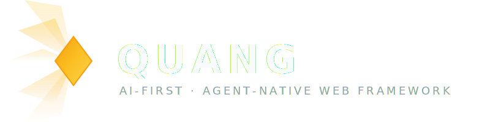

# Quang

<p align="center">
  
</p>

**Quang** compresses the fragmented modern web stack into one unified, typed, graph-aware platform. One prompt creates a full-stack app. Agents build, humans review, the platform ships.

**Philosophy:** Lightweight like Hono, reactive like Signals, hypermedia-simple like HTMX, strongly typed like Rust, productive like TypeScript, AI-native by default. *Light first, power when needed.*

```
Prompt / Goal
    ↓
Agent builds App Graph
    ↓
QuangHub (server + events + AI tools)
    ↓
Data Core (FractalDB / HyperGraph / FluidArray via Kitchen)
    ↓
QuangWeb (HTMX-like UI + Signals + TSX)
    ↓
Deploy (i2c-forge / Cloudflare / AWS / GCP)
```

---

## 🚀 Key Features

- **App as Graph**: Every Quang app is a typed living graph — not a folder of files. One capability auto-generates: human UI + API route + agent tool + event + policy + test + docs.
- **Dual Interface**: Every feature serves both humans (pages, forms, dashboards, chat) and agents (typed tools, schemas, MCP-compatible endpoints) from a single definition.
- **Core Domain Model** (`quang-core`): Unified Task lifecycle, Job DAGs with policy governance, reusable Workflow templates, unified Cost tracking (human + agent + infrastructure), and Agent identity descriptors.
- **Graph-Native Collaboration** (`quang-hub-workplace`): All state lives in a typed HyperGraph. Events drive WebSocket pushes, AI agent triggers, and audit logging. Views project the same data as Table, Kanban, Chart, or Gantt.
- **Repository Integration** (`quang-hub-repo`): GitHub-linked repos with Fluid Remote mirroring, agent QTasks, webhook-driven auto-deploy, and adaptive repo apps from `qh.app` manifests.
- **Real-Time Meetings** (`quang-hub-meet`): WebRTC rooms with signaling, media controls, screen sharing, in-call chat, and recording.
- **Evidence-Based Governance**: Composes Jigsaw's five-level graded trust model (Accept / SoftPass / PushBack / Conflict / Reject) into business-level Policies for every Task and Job.
- **Serverless-First**: Cloudflare Workers with D1, KV, and R2 storage backends. REST + GraphQL APIs. Compiles to Wasm for edge deployment.
- **Composable UI** (`quang-web`): Shared Dioxus component library — app shell, sidebar, topbar, auth hooks, GraphQL client.

---

## 🗂️ Crate Map

| Crate | Role | Key Dependencies |
|-------|------|-----------------|
| [`quang-core`](crates/quang-core/) | Core domain model — Task, Job, Workflow, Agent, Cost, Policy | [Jigsaw](https://github.com/atomixnmc/Jigsaw) (evidence), [MinhAI](https://github.com/i2ccom/MinhAI) (optional agent bridge) |
| [`quang-hub-workplace`](crates/quang-hub-workplace/) | Collaboration graph engine — HyperGraph, EventBus, ViewRegistry, WorkplaceHub | CF Workers, Dioxus |
| [`quang-hub-repo`](crates/quang-hub-repo/) | Repository integration — linked repos, QTask, GitHub client, webhooks, deploy | `quang-hub-workplace`, `git2` |
| [`quang-hub-meet`](crates/quang-hub-meet/) | Real-time meetings — WebRTC rooms, signaling, recording | CF Workers, Durable Objects, Dioxus |
| [`quang-hub-app`](crates/quang-hub-app/) | Dioxus application shell and page router | Dioxus |
| [`quang-hub-cloud`](crates/quang-hub-cloud/) | Cloud deployment module | — |
| [`quang-hub-ts`](crates/quang-hub-ts/) | TypeScript bridge | — |
| [`quang-hub-sdk`](crates/quang-hub-sdk/) | Public SDK surface | — |
| [`quang-shai-ao`](crates/quang-shai-ao/) | Shai IDE agent orchestration bridge | — |
| [`quang-web`](crates/quang-web/) | Shared Dioxus UI components — GraphQL client, auth hooks, app shell | Dioxus |

---

## 📚 Documentation Layout

All documentation follows the unified **i2c convention**:

| Area | Document |
|------|----------|
| Project plan & roadmap | [`docs/PLAN.md`](docs/PLAN.md) |
| Workplace collaboration plan | [`docs/PLAN-Workplace-Collab.md`](docs/PLAN-Workplace-Collab.md) |
| Identity & economics plan | [`docs/PLAN-Workplace-Identity-Economics.md`](docs/PLAN-Workplace-Identity-Economics.md) |
| Workplace architecture | [`crates/quang-hub-workplace/docs/ARCHITECTURE.md`](crates/quang-hub-workplace/docs/ARCHITECTURE.md) |
| Repo architecture | [`crates/quang-hub-repo/docs/ARCHITECTURE.md`](crates/quang-hub-repo/docs/ARCHITECTURE.md) |
| Meet architecture | [`crates/quang-hub-meet/docs/ARCHITECTURE.md`](crates/quang-hub-meet/docs/ARCHITECTURE.md) |
| Quang Web Framework design | [`docs/design/Quang Web Framework.md`](docs/design/Quang%20Web%20Framework.md) |
| Ecosystem integration | [`docs/design/Ecosystem Quang Fractal Fluid Hyper.md`](docs/design/Ecosystem%20Quang%20Fractal%20Fluid%20Hyper.md) |
| Repo design overview | [`docs/design/QuangHubRepo Design Overview.md`](docs/design/QuangHubRepo%20Design%20Overview.md) |
| RsTs language concept | [`docs/ideas/RsTs AI Programming Language.md`](docs/ideas/RsTs%20AI%20Programming%20Language.md) |
| Incentive model | [`docs/ideas/i2c Ecosystem Incentives.md`](docs/ideas/i2c%20Ecosystem%20Incentives.md) |

---

## 🛠️ Developer Setup

### Prerequisites
- [Rust](https://www.rust-lang.org/) (edition 2021)
- Optional: [Cloudflare Workers CLI](https://developers.cloudflare.com/workers/) (`wrangler`) for server features

### Build

```bash
# Check the core crate
cargo check -p quang-core

# Build everything
cargo build --workspace

# Build with server features (CF Workers)
cargo build -p quang-hub-workplace --features server

# Build with web features (Dioxus WASM)
cargo build -p quang-hub-workplace --features web
```

### Run tests

```bash
cargo test --workspace
```

---

## 🧩 Ecosystem

Quang is one pillar of the i2c ecosystem:

| Component | Role | Link |
|-----------|------|------|
| **Jigsaw** | Graded trust verification for content-addressed evidence | [atomixnmc/Jigsaw](https://github.com/atomixnmc/Jigsaw) |
| **MinhAI** | Lightweight local agent orchestrator | [i2ccom/MinhAI](https://github.com/i2ccom/MinhAI) |
| **Fluid** | Content-addressed identity + Git-compatible VCS | [atomixnmc/Fluid](https://github.com/atomixnmc/Fluid) |
| **HyperGraph** | Graph-native knowledge & execution layer | [atomixnmc/HyperGraph](https://github.com/atomixnmc/HyperGraph) |
| **Rings** | Execution & consensus — 13 frozen verbs, Jigsaw evidence, scoped Rings | — |
| **i2Collab** | Orchestration platform integrating the full stack | — |
| **i2c-Forge** | Federation and decentralized hosting | — |

---

## 🏗️ Architecture

```
┌──────────────────────────────────────────────────────────────┐
│                      Quang IDE (shai)                        │
│              AI agent control + graph dev view               │
└────────────────────────────┬─────────────────────────────────┘
                             │
┌────────────────────────────▼─────────────────────────────────┐
│                         QuangHub                             │
│    Routes │ Events │ Streams │ AI tools │ MCP │ GraphQL      │
└────────────────────────────┬─────────────────────────────────┘
                             │
┌────────────────────────────▼─────────────────────────────────┐
│                      Quang Data Core                         │
│  FractalDB │ HyperGraph │ FluidArray │ Kitchen query planner │
└────────────────────────────┬─────────────────────────────────┘
                             │
┌────────────────────────────▼─────────────────────────────────┐
│                         QuangWeb                             │
│  HTMX-like q-* │ Signals │ TSX │ GraphQL │ Wasm islands      │
└────────────────────────────┬─────────────────────────────────┘
                             │
┌────────────────────────────▼─────────────────────────────────┐
│                    Deployment Targets                        │
│  i2c-forge │ Cloudflare Workers │ AWS │ GCP │ Local          │
└──────────────────────────────────────────────────────────────┘
```

---

## Design Rules

1. **Light first.** Small core, optional modules. No forced ORM, GraphQL, AI provider, or cloud.
2. **Capability over code.** Agents generate capabilities, not raw files. Capabilities compile into everything.
3. **Dual interface always.** Every feature serves humans (UI) and agents (tools/schemas) from one definition.
4. **App Graph is truth.** Natural language is input; the typed graph is the canonical representation.
5. **Permissioned by default.** AI tools are typed, permissioned, audited, and replayable — never raw API access.
6. **Migration-friendly.** Git-compatible, npm-compatible, GraphQL-compatible. Adoption doesn't require replacing everything.

---

## License

MIT
